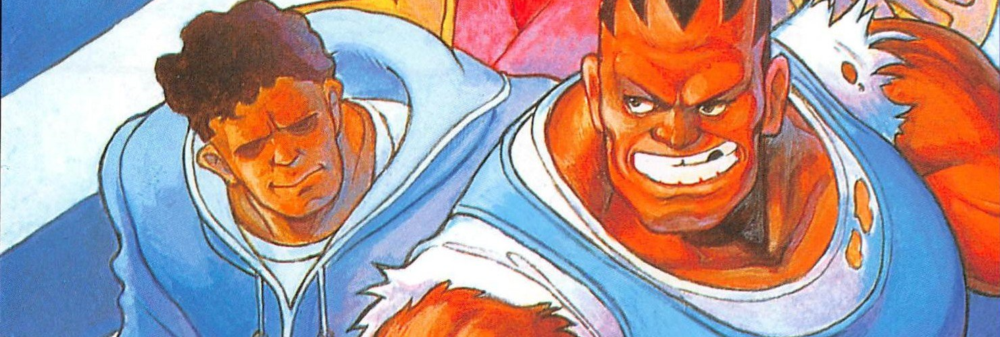

# Character Strategy Guide

  
Resources

* [ToniToniVersus - Balrog Move List](https://youtu.be/dfPMQB4H0Ss?si=1eXlYwZ3Ui8iVmEG)
* [Andor - How to play Boxer in 3 minutes!](https://youtu.be/9jyY7vGSHyw)
* [Bazoukha - Boxer Tuto - Part 1](https://youtu.be/w5Z-ignB6y0) / [Part 2](https://youtu.be/jXcMG7GM7tw)
* [Fighter101 - Balrog TAP guide](https://youtu.be/PrnYWfezoeM)
* [Abdel2x - Combos, BnB & ToD](https://www.youtube.com/watch?v=i73GT29GIfg)
* [Silentscope88 - Combo Trial Video](https://www.youtube.com/watch?v=8NF8qJ8Wxno)
* [Fighter101 - Combo exhibition & Guide](https://youtu.be/_igTkYXqpvU)
* [Bison Taro - Bison Super cancel](https://youtu.be/mkKqSexapL4)
* [ST - Super Canceling Techniques](https://sonichurricane.com/?p=394)

  
Basics

#### 1. Pokes
<video data-videojs data-src="media/videos/guide/pokes.mp4"
class="video-js vjs-theme-city"></video>

|  |  |
| :--- | :--- |
| 5LP | Cancelable |
| 2LP | Tick throw   Frametraps   Preemptive attack |
| 2MP | Cancelable   Frametraps |
| 2MK | Meaty   Frametraps   Low counter (slides, 2MK, etc.)   Link: 2MP or Super |
| 5HP | Long range   Frametraps |

#### 2. Anti-air
<video data-videojs data-src="media/videos/guide/anti-air.mp4"
class="video-js vjs-theme-city"></video>

##### Headbutt
Headbutt has invincible startup, can pass through projectiles, and is useful for frametraps. It is generally safe depending on the range and matchup. LP Headbutt is the fastest version but travels the shortest distance, while MP and HP Headbutts are slower and reach farther.

|  |  |
| :--- | :--- |
| Anti-air Normals | 2HP or 5MP |
| Anti-air Specials | Upper or Headbutt |

#### 2. Throw

<video data-videojs data-src="media/videos/guide/throw.mp4"
class="video-js vjs-theme-city"></video>

Use MP throw since it has the highest range, and st.MP can also act as an anti-air. 
After a successful throw, follow with powerful mixups.

##### Throw mixups
* After a throw, mix by staying in front or go behind. Then, confirm or tick throw and repeat.
* Fake going behind, then use 2HK to bait a button press (looses to invincible reversal)
* ⚠️ Mixup timing varies by character, you should practice it for consistency.

|  |  |
| :--- | :--- |
| Throw setups | 2LP,2LP > throw (or mix with headbutt)   2MP or 2MK > micro walk > throw   On crouch: whiff Ground Upper > throw |
| Throw > Safe Jump | Hold (9) during throw for an auto-timed safe jump.   Only works midscreen on Boxer, FeiLong (jHP) and Cammy (jLK). |
| Throw > Meaty combos | Throw > Meaty 2MK > 2HK or 5HP   Only on Hawk, Sagat, Gief, Boxer and Honda |

#### 4. Super - Crazy Buffalo
<video data-videojs data-src="media/videos/guide/boxer_crazy_buffalo.mp4"
class="video-js vjs-theme-city"></video>

This fast, invincible super deals high damage and beats projectiles. It is great for punishing fireballs, chipping out low-health opponents, using as a wake-up reversal, or combos. However, it leaves a gap at a distance, making it unsafe.

##### Notes
* Quicker inputs, use diagonals instead of back/forward: `[1],3,1,3+P/K`
* Upper (K) whiffs on crouch. Hold (P) to only use straights. 
* End with headbutt to keep pressure (risky - unsafe).

#### 5. Turn Around Punch (TAP)
<video data-videojs data-src="media/videos/guide/TAP.mp4"
class="video-js vjs-theme-city"></video>

* Hold then release PPP or KKK
* TAP has 8 levels, increasing with hold time. Higher levels boost speed, range, damage, and blockstun.
* TAP lets you quickly close distance, find trades, sets up frametraps, meaties, and build meter. It's useful against zoners and deals high damage or reward.

##### Tips
* Begin with level 2: Hold TAP before the round start
* Hold PPP/KKK during a special then release.
* Quickly use TAP right after a special (and vice versa)

#### 6. Charge management
<video data-videojs data-src="media/videos/guide/boxer_charge_management.mp4"
class="video-js vjs-theme-city"></video>

* Quickly chain specials to improve mobility, build meter, find openings, and more.
* Follow with TAP to gain more movement options and meter-building possibilities.

|  |  |
| :--- | :--- |
| Headbutt > Dash | Hold (7) to Headbutt, then go (3 or 6) to dash |
| Dash > Headbutt | Dash by holding (3), then go (9) for headbutt. |
| Upper LK > Super | Upper LK, then quickly input 4,6+P/K. |
| Headbutt > Super | Hold (7) to Headbutt, then quickly input 4,6+P/K. |

  
Advanced

#### 1. Meter build
<video data-videojs data-src="media/videos/advanced/Meter_build.mp4"
class="video-js vjs-theme-city"></video>

* Having super is crucial in hard matchups.
* Build meter whenever possible by whiffing special moves, especially after a knockdown.

##### Midscreen - Knockdown
| Starter       | Route                          |
|---------------|--------------------------------|
| Dash low      | TAP / Headbutt LP             |
| Ground Upper  | Headbutt   TAP > Headbutt LP                      |
| Headbutt      | TAP > Upper     Ground Upper > Headbutt             |
| Super         | TAP > Upper    Upper > Headbutt   Headbutt > Upper              |

##### Corner - Knockdown
| Starter       | Route                          |
|---------------|--------------------------------|
| Ground Upper      | TAP / Headbutt             |
| Headbutt  | TAP / Upper                      |
| Super  | TAP / Upper / Headbutt             |

#### 2. Frametraps
<video data-videojs data-src="media/videos/advanced/frametrap.mp4"
class="video-js vjs-theme-city"></video>

* Prevent opponents from mashing throws or buttons while blocking. 
* Punish their mash attempts and hit confirm when possible... or condition them with tick throws.
* ⚠️ Frametraps lose to reversals and may vary depending on the matchup

|  |  |
| :--- | :--- |
| Ground | 5MK > 2MK / 2MP   2MK > 2MK / 2HK / 5HP   2MP > 5HP / 2MK   2LP,2LP > 2MP / 2HK   2LP,2LP > Headbutt   2LP,2LP,2LP > 2MP   Dash low LP > 5HP   Dash low LP > Headbutt |
| Jump | j.MP > 2HK / 2MP |
| TAP | TAP lvl 3+ > Super   TAP lvl 3+ > Headbutt (need proper spacing)|

#### 3. Safe jumps
<video data-videojs data-src="media/videos/advanced/SafeJump.mp4"
class="video-js vjs-theme-city"></video>

⚠️ There's no safe jump against Ken's HP Shoryuken.
✅ Try learning the jump timing without using those setups to be less predictable.

|        |                           |
|---------------|--------------------------------|
| Midscreen | - Dash low > 2LP > j.HP   - 2HK > 2LP > j.HP   - Headbutt > Upper > 2LP > j.HP   - Ground Upper > TAP lvl1 > j.HP            |
| Corner | - Dash low > j.HP   - Headbutt > 2LP > j.HP   - Ground Upper > 2MK > j.HP            |
| During throw | - Hold (9) > jHP (Boxer, Feilong)   - Hold (9) > jLK (Cammy)            |

#### 4. Ground Upper Mixups
<video data-videojs data-src="media/videos/advanced/Ground_Upper.mp4"
class="video-js vjs-theme-city"></video>

Ground Upper is quick and misses on crouch, but it keeps you close for MP throw, meaty, Headbutt, or Super. You can also use it on the opponent’s wake‑up.
At mid range, use Upper LK to quickly react to opponents walking forward.

#### 5. Fuzzy & Instant overhead
Fuzzy and instant overheads can be unsafe on block, you should use them to finish the opponent.

|        |                           |
|---------------|--------------------------------|
| Instant overhead | - j.LK or neutral jump LP/LK  |
| Fuzzy | - j.LK > j.LK |
| Setups (all ranges)| - (Knockdown) Dash low --> whiff TAP > j.LK   - (On crouch) Whiff Ground Upper > j.LK   - Throw --> walk > j.LK (need timing) |

#### 6. Side switch & Cross down
<video data-videojs data-src="media/videos/advanced/HeadbuttSideSwitch.mp4"
class="video-js vjs-theme-city"></video>

|        |                           |
|---------------|--------------------------------|
| Midscreen      | - Headbutt anti-air --> Dash low > Headbutt HP   - Headbutt --> Upper > Headbutt HP   - Throw > Walk            |
| Corner      | - Throw > Upper   - Throw > Walk  |

##### Notes
* Upper cross-down only works on Sim, Boxer, Guile, Ryu, Ken, Claw, Dict and Chun-Li.
* Trick your opponent with Upper > Super or Headbutt

#### 7. Dash autocorrect
<video data-videojs data-src="media/videos/advanced/AutocorrectDashes.mp4"
class="video-js vjs-theme-city"></video>

* Hold your charge and press a button as they cross behind you (without switching direction). 
* Works well against Claw's Flying Barcelona.

#### 8. Auto-Stand Bug
<video data-videojs data-src="media/videos/advanced/AutoStand.mp4"
class="video-js vjs-theme-city"></video>

* A bug makes boxer's 2LP act as 5LP. Whiff 5LP to store the bug. Try with 2LK,2LP (boxer will auto-stand).
* The bug ends at round start or after a whiffed punch or standing kick, but stays with LP mash, crouch kicks, specials or super.
* When the bug is active, mash stand LP without losing your down charge, letting you perform a headbutt from standing to surprise your opponent.

#### 9. Walk > Super

Boxer’s Super can be broken into parts, letting you charge then walk for up to 26F without losing the input. Use this tech after a throw (cross down), or to fake a walk > throw.

* Optimal route for longer Walk:
  * Part 1: charge and walk up to 15F
  * Part 2: back 1F
  * Part 3: walk up to 11F then press P

  
Combos

#### 1. Hit confirm
<video data-videojs data-src="media/videos/combos/normal_confirms.mp4"
class="video-js vjs-theme-city"></video>

* 2LP,2LP is a chain combo
* 2LK~2LK, is a link by default.

##### Normal confirms
* 5LP/2LP > Dash
* 2LK > Dash
* 2MP > Dash
* 2MK > 2MP > Dash

##### Standing Opponent
* 2LP, 2LP, 5LP > Dash
* 2MK > 5LP > Dash

#### 2. Jump-Ins
<video data-videojs data-src="media/videos/combos/jump-in.mp4"
class="video-js vjs-theme-city"></video>

* Hit deep (center of body) to confirm a jump-in, otherwise it won't combo.

##### Jump-Ins
* j.HP or j.MP > 5HP
* j.HP > 5MK > Dash
* j.HP > 2MP > Dash
* j.HP > 2MK > 2MP > Dash
##### Standing Opponent
* j.HK, 2LP > 5LP > Dash

#### 3. Super
<video data-videojs data-src="media/videos/combos/super_cancel.mp4"
class="video-js vjs-theme-city"></video>

##### Super link
* 2MK > Super
* 2MK, 2MK > Super
##### Super cancel
* 2MP or 2HP > Super
* 2MK > 2MP > Super
* 2MK > 5MK > Super
##### Renda cancel (Super chain cancel)
* 2LP, 2LP, 2LP > Super : `[1]LP,LP > 321LP > 6LP~MP`
* 2LP, 2LP, 5LP > Super : `[1]LP,LP > 3214LP > 6LP~MP`

